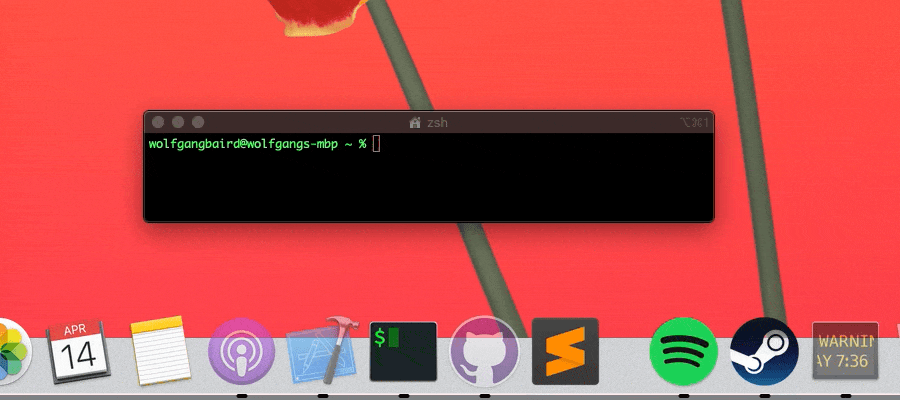

# Goodbye

# Information:

- Designed for 10.9+   
- Goodbye is a MacForge Plugin to make all applications quit when the last window closes
- Author: [MacEnhance](https://github.com/MacEnhance)

# functionality:

- All applications will quit when the last window closes

# Blacklisting:

- To add an app the blacklist

1. Find the bundle ID of the application you want to blacklist. EG: `com.googlecode.iterm2`
2. Open `/System/Applications/Utilities/Terminal.app`
3. Enter the command `defaults write com.googlecode.iterm2 GoodbyeBlacklist -bool true`
4. Restart the application

- To remove an app, replace `true` with `false`

# Installation:

1. Download and open [MacForge](https://github.com/w0lfschild/app_updates/raw/master/MacForge/MacForge.zip)
2. Install [Goodbye](https://www.macenhance.com/mflink?com.macenhance.Goodbye)

# License:

Pretty much the BSD license, just don't repackage it and call it your own please!    
Also if you do make some changes, feel free to make a pull request and help make things more awesome!
